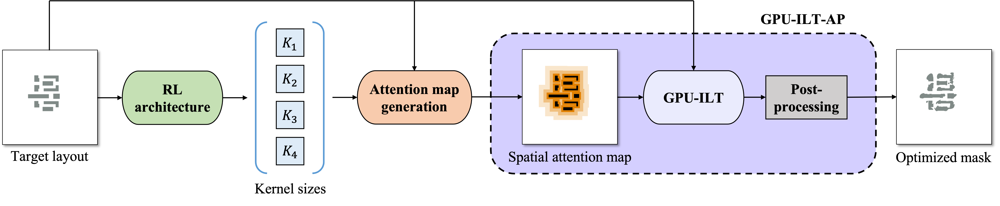
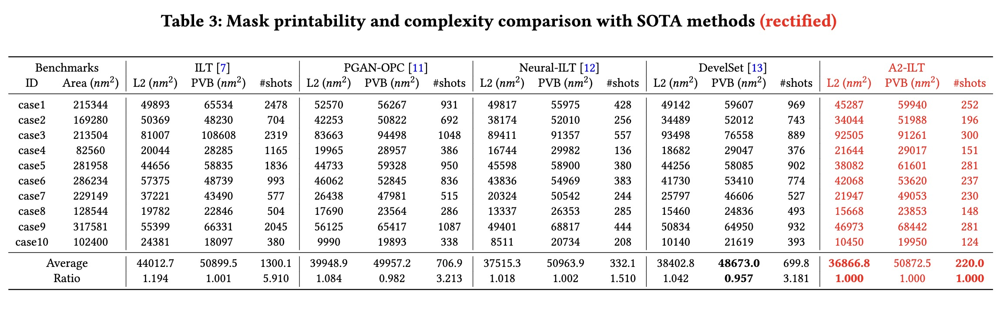
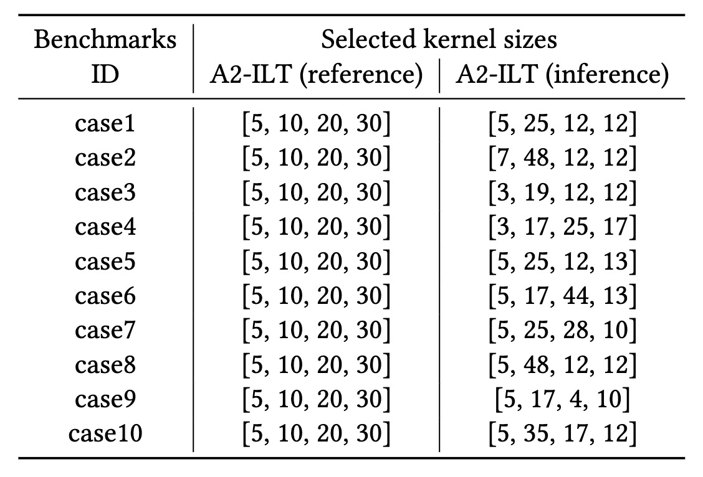
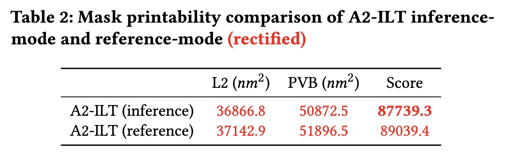

# A2-ILT

## Overview

This repository is the official implementation for the paper: 

Qijing Wang, Bentian Jiang, Martin D.F. Wong and Evangeline F.Y. Young, “[A2-ILT: GPU Accelerated ILT with Spatial Attention Mechanism](https://dl.acm.org/doi/abs/10.1145/3489517.3530579)”, ACM/IEEE Design Automation Conference (DAC), San Francisco, CA, Jul. 10-14, 2022.


## Framework



## (Update 2022.12.02) Rectified results and source released

We have released the codes of A2-ILT, together with an example checkpoint of the trained RL model, which obtains the following results and thus we here make a rectification again.


The comparison of selected kernel sizes in reference mode (manually provided) and inference mode (RL-determined) is shown as follows, together with the corresponding results.




Since there is a trade-off between printing error (L2) and process variation band (PVB), we are also trying to assign different weights to these two parts to produce weighted rewards (rather than current simple summation), and use it to train the RL model again, so that a more balanced performance can be achieved. We will update the codes and checkpoints when there is progress.

Please note that some corresponding adjustments are made in the codes to adapt to bug fixing:
1. The available range of the four kernels sizes are changed from [1-10, 26-35, 46-55, 66-75] to [0-9, 0-49, 0-49, 0-49], while the action dimension of RL model is adjusted from 10 to 50. Therefore, it increases the training difficulty to some extent, but can help reduce manual work and enhance adaptivity.
2. The activation function in RL model is changed from ReLU to SiLU, with Group Normalization added, for easier and more stable training. The basic network architecture remains the same.
3. The weights of loss function are changed from alpha=0.9 & beta=0.1 to alpha=0.8 & beta=0.2, the learning rate is changed from 1 to 1.5.

## Requirements

-   python: 3.8.11
-   pytorch: 1.8.1
-   torchvision: 0.9.1
-   opencv: 4.5.5.62
-   cudatoolkit: 11.1.74

## Usage

### Installation

~~~bash
$ git clone https://github.com/cuhk-eda/A2-ILT.git
$ cd A2-ILT
$ mkdir result
$ mkdir output
~~~

### Quick start

The trained RL model checkpoint is provided in ./PPO_model/A2ILT, you may simply run the following to reproduce the rectified results on [ICCAD 2013 mask optimization contest benchmarks](https://ieeexplore.ieee.org/document/6691131). After running, the 'L2 error' and 'process variation band' results will be saved in ./result and the optimized masks and the corresponding wafer images will be saved in ./output, you can delete --save_optimized arg if you do not want to save them.

~~~bash
$ python A2_ILT.py --layout_list ./dataset/ibm_opc_test_list.txt --log ./result/ibm_opc_test_l2_pvb.txt --ckpt best --save_optimized
~~~


### Run on custom data

The [layout dataset](https://github.com/phdyang007/GAN-OPC) used for training the RL model is obtained from the authors of [GAN-OPC](https://ieeexplore.ieee.org/document/8465816), which is in the same 32nm-style as the test cases. So if you would like to apply A2-ILT on layouts in other styles, you need to adjust the reference attention kernel sizes and train the RL model using your custom data. Please note that the size of input layout image should be 2048*2048 so that the lithography simulation can work correctly.

Please generate your 'data list' file in the same format as ./dataset/ibm_opc_test_list.txt and also put it in the ./dataset folder, like the provided example ./dataset/RL_train_layout.txt.

Then, run the GPU-ILT-AP module separately as follows to manually select 'not bad' attention kernels (by providing different kernel size list to --ref_attn_kernel) that are suitable for your custom data by checking the quality (L2 and pvb), which serves as the reference strategy. (Check [paper](https://dl.acm.org/doi/pdf/10.1145/3489517.3530579) for more details)

```
$ python GPU_ILT_AP.py --layout_list PATH_TO_TRAIN_LAYOUTS --ref_attn_kernel YOUR_REF_KERNELS

For example:

$ python GPU_ILT_AP.py --layout_list ./dataset/RL_train_layout.txt --ref_attn_kernel 5 10 20 30
```

After that, you can add --create_RL_data arg to generate the 'reference reward' file, which will be saved in PATH_TO_REWARD_LOG provided to --RL_reward_log:

```
$ python GPU_ILT_AP.py --layout_list PATH_TO_TRAIN_LAYOUTS --ref_attn_kernel YOUR_REF_KERNELS --create_RL_data --RL_reward_log PATH_TO_REWARD_LOG

For example:

$ python GPU_ILT_AP.py --layout_list ./dataset/RL_train_layout.txt --ref_attn_kernel 5 10 20 30 --create_RL_data --RL_reward_log ./dataset/RL_ref_reward.txt
```

Then, run the following to train the RL model, which can be resumed by providing checkpoint path to --resume_ckpt. The action dimension of RL model can be adjusted according to your situations by setting the 'action_dim' hyperparameter, you can also change the range of the four kernel sizes by modifying the relationships between kernel sizes and actions in the Env_Reward_Update() function of PPO_agent.py.

```
$ python RL_train.py --layout_list PATH_TO_TRAIN_LAYOUTS --ref_attn_kernel YOUR_REF_KERNELS --ref_reward PATH_TO_REWARD_LOG --resume_ckpt None

For example:

$ python RL_train.py --layout_list ./dataset/RL_train_layout.txt --ref_attn_kernel 5 10 20 30 --ref_reward ./dataset/RL_ref_reward.txt --resume_ckpt None
```

After training, you can run A2-ILT to evaluate on your custom test data as follows:

```
$ python A2_ILT.py --layout_list PATH_TO_TEST_LAYOUTS --ref_attn_kernel YOUR_REF_KERNELS --log PATH_TO_LOG --ckpt CHECKPOINT_INDEX --save_optimized

For example:

$ python A2_ILT.py --layout_list ./dataset/test_layout_list.txt --ref_attn_kernel 5 10 20 30 --log ./result/custom_test_l2_pvb.txt --ckpt 299 --save_optimized
```


## (Update 2022.11.10) Bug fixing and rectified results

Thanks to some colleagues, we were aware of a bug in process variation band calculation in our original implementation, which led to a wrong result. We here sincerely APOLOGIZE for our mistakes! 

We tentatively provide a rectified version where the attention kernel sizes are just simply determined by a random exploration model. The kernel sizes are written into ./configs/attn_kernels.txt, you can run the following to reproduce the temporary results.

~~~bash
python A2_ILT.py --layout_list ./dataset/ibm_opc_test_list.txt --log ./result/ibm_opc_test_l2_pvb.txt --load_from_configs
~~~


## Citation
if A2-ILT is helpful for your research, please consider citing:
```
@inproceedings{wang2022a2,
  title={A2-ILT: GPU accelerated ILT with spatial attention mechanism},
  author={Wang, Qijing and Jiang, Bentian and Wong, Martin DF and Young, Evangeline FY},
  booktitle={Proceedings of the 59th ACM/IEEE Design Automation Conference},
  pages={967--972},
  year={2022}
}
```

## Acknowledgement
Thanks to everyone who makes their code or data available:

- [Neural-ILT](https://github.com/cuhk-eda/neural-ilt)
- [GAN-OPC](https://github.com/phdyang007/GAN-OPC)
- [PPO-PyTorch](https://github.com/nikhilbarhate99/PPO-PyTorch)

## Contact
Qijing Wang (qijingw26@gmail.com) 

## License
READ THIS LICENSE AGREEMENT CAREFULLY BEFORE USING THIS PRODUCT. BY USING THIS PRODUCT YOU INDICATE YOUR ACCEPTANCE OF THE TERMS OF THE FOLLOWING AGREEMENT. THESE TERMS APPLY TO YOU AND ANY SUBSEQUENT LICENSEE OF THIS PRODUCT.

License Agreement for A2-ILT

Copyright (c) 2022, The Chinese University of Hong Kong All rights reserved.

CU-SD LICENSE (adapted from the original BSD license) Redistribution of the any code, with or without modification, are permitted provided that the conditions below are met.

Redistributions of source code must retain the above copyright notice, this list of conditions and the following disclaimer.

Redistributions in binary form must reproduce the above copyright notice, this list of conditions and the following disclaimer in the documentation and/or other materials provided with the distribution.

Neither the name nor trademark of the copyright holder or the author may be used to endorse or promote products derived from this software without specific prior written permission.

Users are entirely responsible, to the exclusion of the author, for compliance with (a) regulations set by owners or administrators of employed equipment, (b) licensing terms of any other software, and (c) local, national, and international regulations regarding use, including those regarding import, export, and use of encryption software.

THIS FREE SOFTWARE IS PROVIDED BY THE AUTHOR "AS IS" AND ANY EXPRESS OR IMPLIED WARRANTIES, INCLUDING, BUT NOT LIMITED TO, THE IMPLIED WARRANTIES OF MERCHANTABILITY AND FITNESS FOR A PARTICULAR PURPOSE ARE DISCLAIMED. IN NO EVENT SHALL THE AUTHOR OR ANY CONTRIBUTOR BE LIABLE FOR ANY DIRECT, INDIRECT, INCIDENTAL, SPECIAL, EXEMPLARY, OR CONSEQUENTIAL DAMAGES (INCLUDING, BUT NOT LIMITED TO, EFFECTS OF UNAUTHORIZED OR MALICIOUS NETWORK ACCESS; PROCUREMENT OF SUBSTITUTE GOODS OR SERVICES; LOSS OF USE, DATA, OR PROFITS; OR BUSINESS INTERRUPTION) HOWEVER CAUSED AND ON ANY THEORY OF LIABILITY, WHETHER IN CONTRACT, STRICT LIABILITY, OR TORT (INCLUDING NEGLIGENCE OR OTHERWISE) ARISING IN ANY WAY OUT OF THE USE OF THIS SOFTWARE, EVEN IF ADVISED OF THE POSSIBILITY OF SUCH DAMAGE.